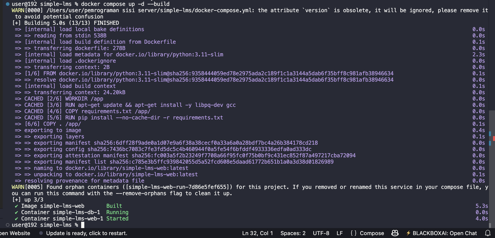
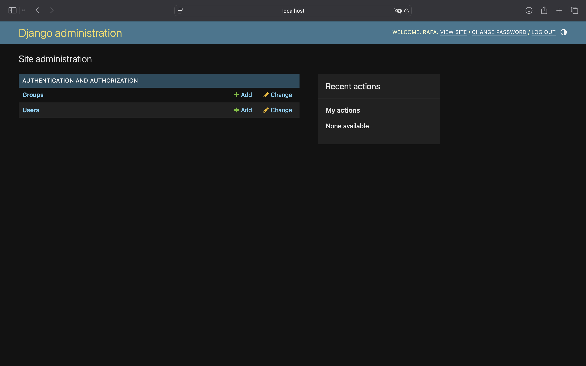
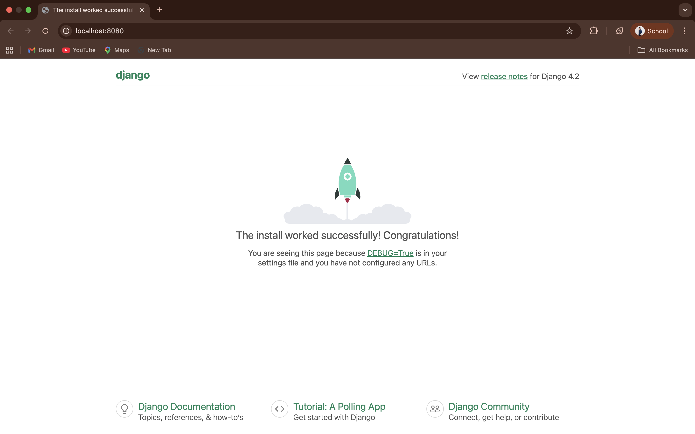

# Simple LMS - Django Docker Environment

Proyek ini adalah *environment development* untuk sistem **Simple LMS** menggunakan framework Django yang di-containerization dengan Docker. Proyek ini diatur menggunakan *best practices* dengan memisahkan konfigurasi *environment variables* dan menggunakan PostgreSQL sebagai database utama.

---

## 📂 Project Structure
Struktur direktori proyek ini telah disesuaikan dengan standar *best practice* yang diminta:

```text
simple-lms/
├── docker-compose.yml   # Konfigurasi services untuk Docker (Web & Database)
├── Dockerfile           # Instruksi build image untuk container Django
├── .env.example         # Template konfigurasi environment variables
├── requirements.txt     # Daftar dependensi library Python
├── manage.py            # Command-line utility bawaan Django
├── config/              # Direktori konfigurasi utama project Django
│   ├── settings.py      # Konfigurasi database, static files, dan env vars
│   ├── urls.py          # Routing URL utama
│   └── wsgi.py          # Entry-point untuk WSGI web servers
├── img/                 # Folder untuk menyimpan screenshot dokumentasi
└── README.md            # Dokumentasi proyek (file ini)

🛠️ Cara Menjalankan Project
1. Persiapan: Pastikan Docker Desktop sudah berjalan di latar belakang.
2. Build Container: Jalankan perintah berikut untuk membangun image:
    docker compose up -d --build
3. Migrasi Database: Lakukan migrasi agar tabel PostgreSQL terbuat:
    docker compose run --rm web python manage.py migrate
4. Akses Aplikasi: Buka browser di http://localhost:8080
5. API Docs: Buka http://localhost:8080/api/docs
6. Postman Collection: Impor file `postman_collection.json` untuk pengujian endpoint.

```
## 📸 Dokumentasi

**1. Cara Menjalankan**



**2. Konfigurasi Django Admin Panel:**



**3. Django Welcome Page:**

